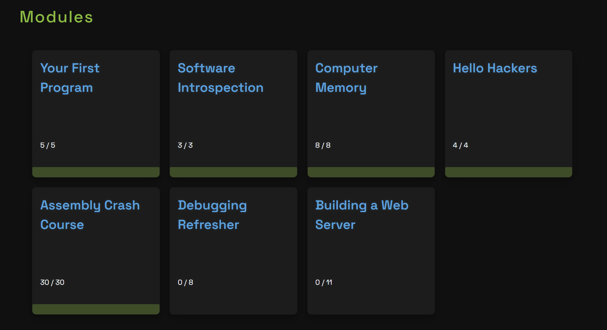

# GL Learning Process

## What are the resources I used for my learning project?
I used resources such as:
* The online **Assembly Crash Course** 
* YouTube videos

Based on the Learning Contract, I also completed the **Assembly Crash Course for Computing 101** from pwn.college.

## Project Outcome
Another goal for my Learning Contract was to create a small project based on what I’ve learned in Assembly. After doing some research, I decided to try to create a **simple calculator**, specifically the addition function for single-digit numbers.

The code can be found in the `calc.asm` file.
